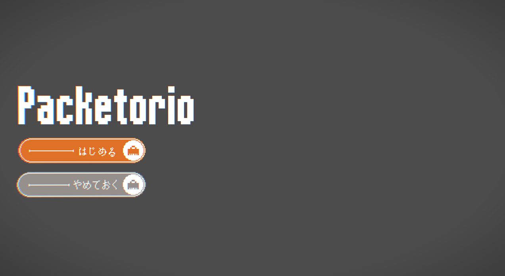
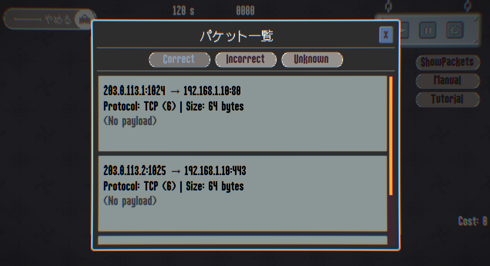
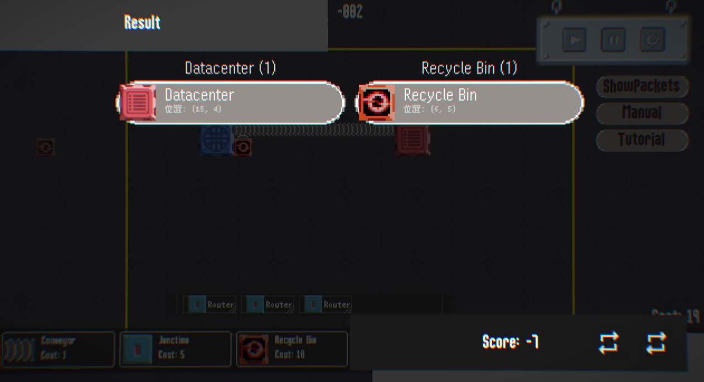

# Packetorio



## Packetorioって？

Packetorioは、ゲーミフィケーションを通じてネットワークセキュリティの基本を学ぶために開発されたビデオゲームです。プレイヤーは、インターネットから流入する良性パケットと悪性パケットを適切に分別し、データセンターへ届けることを目指しております。


## 背景と課題

近年、コンピュータネットワークの利用は急激に増加し、それに伴いサイバー攻撃の脅威も深刻化しています。この状況はセキュリティ人材の需要を押し上げていますが、特に、高度な専門家だけでなく、組織内で基本的なセキュリティ対策を担える中程度のスキルを持つ人材が著しく不足しているのが現状です。

一方で、ネットワークセキュリティは多様な要素を含む応用分野であり、初学者にとっては学習のハードルが高いという課題があります。多くの学習が専門的なキャリア形成を前提とするため、「基本的な知識を持つ人材」を広く育成することが困難になっています。

「じゃあどうする？」  
私たちはこの課題に対し、Packetorioを開発しました。

## もっと具体的に

Packetorioは、複雑なネットワークの概念を大幅に簡略化し、本質的な学びに集中できるよう設計されています。

### 簡略化

既存のネットワークシミュレータとは異なり、Packetorioに登場するパケットは、IPアドレス、ポート番号、サイズ、ペイロードといった基本的な情報のみで構成されます。これは、専門的な知識の注入ではなく、ネットワークセキュリティの初学者が「基本的な概念」や「セキュリティ対策の困難性」を直感的に理解することに主眼を置いているためです。


*表示されるパケット情報*

### 学べる内容

各ステージは、特定のサイバー攻撃を想定したシナリオに基づいており、プレイヤーは出現するパケットの中から悪性のものだけを廃棄し、正常なパケットをデータセンターに届ける経路を構築する必要があります。

ステージ終了後にはスコアが表示されます。スコアは、データセンターに届いたパケットの正確性（偽陽性・偽陰性の少なさ）と、設置したコンポーネントのコストによって決定されます。より高いスコアを目指す過程で、プレイヤーは「セキュリティと利便性のトレードオフ」や「完璧なフィルタリングの難しさ」を実感しながら学ぶことができます。

もちろんどこに「何が届いた結果このスコアになったか」というのも調べることが出来ます。


*スコアリング*

### 拡張性

Packetorioは、学習者の習熟度や目的に応じて、誰でも新たなステージを追加できるよう設計されています。ステージを構成するオブジェクトの配置や出現するパケットの情報は、人間が読み書きしやすいJSON形式で記述できます。

## 今後の展望

*   **フィルタの規格化**: ユーザーが新たなフィルタを定義・追加できる機能
*   **動作の安定化**: UI/UXの改善を含む、さらなる品質向上
*   **pcapからのステージ生成**: 実際のキャプチャデータからステージを生成する機能

## ダウンロード

ゲーム本体は、以下のリンクからダウンロードできます。ビルドは不要です。

gdr_mws.dll
packetorio.exe
packetorio.pck
全てをダウンロードしてください。

[**Packetorio v1.0.0 をダウンロード**](https://github.com/darallium/Packetorio/releases/tag/v1.0.0)


## 参加したい？

本プロジェクトの開発に参加する場合、環境に **Rust Toolchain** と **Godot Engine (v4.4.1)** が必要です。

1.  **クローンします。**
    ```bash
    git clone https://github.com/darallium/Packetorio.git
    cd Packetorio
    ```

2.  **ビルドします。**
    ```bash
    cd rust
    cargo build
    ```

3.  **Godotプロジェクトを実行します。**
    Godot Engineを起動し、「インポート」からプロジェクトルートにある `godot` ディレクトリを選択します。
