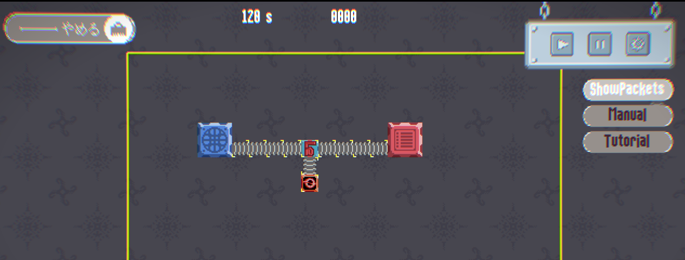

# Packetorio

## 概要

`Packetorio` は、ネットワークセキュリティの基礎、特にパケットフィルタリングの概念を、工業ゲームの要素を取り入れながら学べるシミュレーションゲームです。プレイヤーはネットワーク上にコンポーネントを配置・設定し、流れてくるパケットを適切に処理することで、サイバー攻撃からデータセンターを守ります。


## ダウンロード

最新のリリースは以下のリンクからダウンロードできます。

[**Packetorio v1.0.0**](https://github.com/darallium/Packetorio/releases/tag/v1.0.0)

## 背景と目的

現代社会において、ネットワークの利用は加速度的に拡大し、それに伴いサイバー攻撃の脅威も増大しています。多くの企業、特に中小企業では、高度な専門知識がなくとも、基本的なネットワークセキュリティ（例：フィルタの設計）を理解し、対応できる人材が求められています。

しかし、そのような人材の育成は容易ではありません。本プロジェクトは、この課題に対し「ゲーミフィケーション」というアプローチで解決を目指します。複雑な概念をシンプルで直感的なゲームに落とし込むことで、ネットワークの基礎知識を持つエンジニアが楽しみながらパケットフィルタリングの考え方を学び、実践的な意思決定能力を養うことを目的としています。

このゲームを通じて、セキュリティの基礎を理解する人口を増やし、簡単な問題は自ら解決を試み、手に負えない問題は専門家に正しく依頼できる、といった適切な判断ができる人材を育成することを目指します。

## 特徴

*   **工場設計**: 複雑なコマンドや設定ファイルを扱う代わりに、コンポーネントをドラッグ＆ドロップで配置する直感的なUIでネットワークを構築できます。

    

*   **ゲーミフィケーション**: 工業ゲームのようにパケットの流れを設計し、ラインを最適化していく楽しさを通じて、学習意欲を自然に引き出します。

    

*   **本質への集中**: 高度で複雑な設定項目をあえて排除し、フィルタリングの「考え方」そのものに焦点を当てています。これにより、プレイヤーはセキュリティ対策の基本的な意思決定プロセスを体験的に学ぶことができます。

## 技術スタック

*   **ゲームエンジン (フロントエンド)**: Godot Engine v4.4.1
*   **コアロジック (バックエンド)**: Rust (GDExtension を通じて Godot と連携)

## 開発したい？

独自にビルドを行うには、**Rust Toolchain** と **Godot Engine (v4.4.1)** がインストールされている必要があります。

1.  **リポジトリをクローンします。**
    ```bash
    git clone https://github.com/darallium/Packetorio
    cd packetorio
    ```

2.  **Rustバックエンドをビルドします。**
    プロジェクトのコアロジックをコンパイルし、Godotから利用できるダイナミックライブラリを生成します。
    ```bash
    cd rust
    cargo build
    ```

3.  **Godotプロジェクトを実行します。**
    Godot Engineを起動し、「インポート」からプロジェクトルートにある `godot` ディレクトリを選択します。あなただけの*Packetorio開発*の始まりです。
